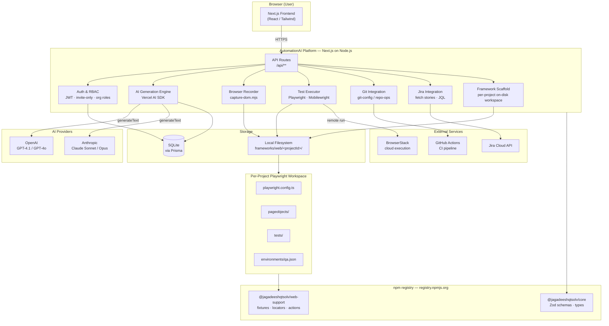
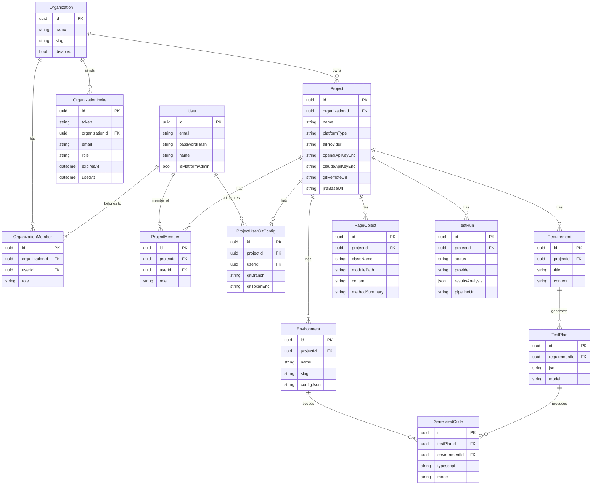
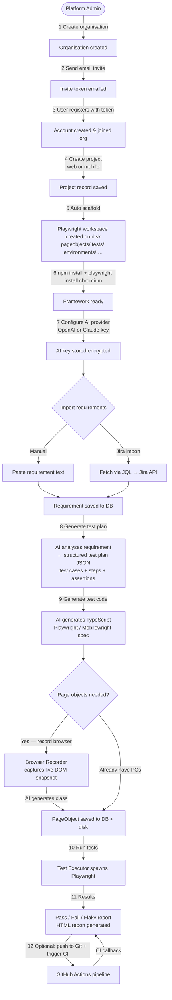
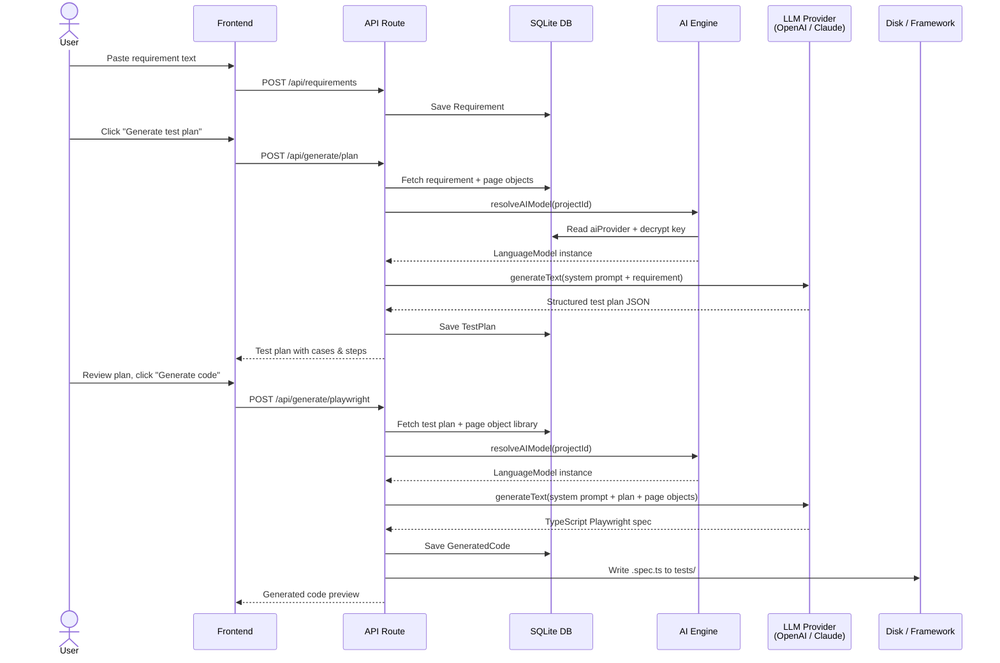
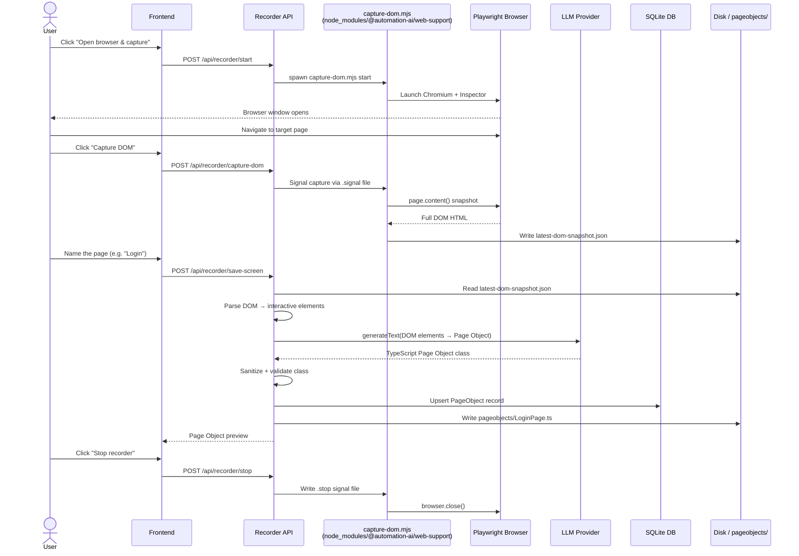
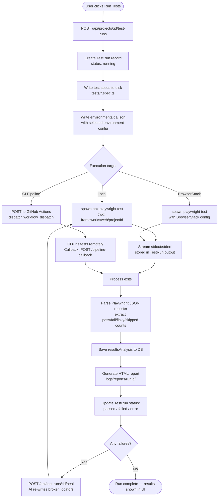
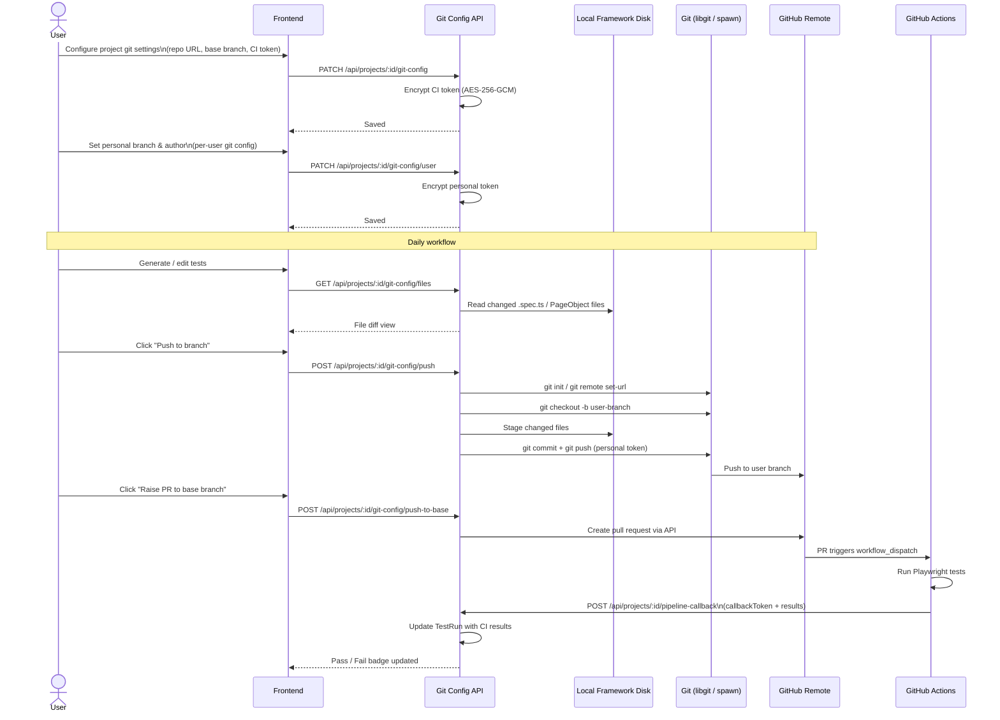
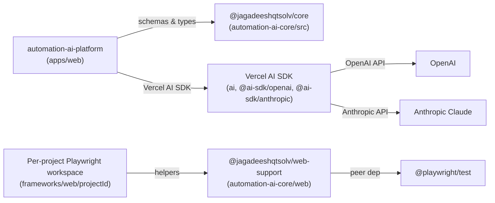

# AutomationAI — Architecture & Flow Diagrams

All diagrams use [Mermaid](https://mermaid.js.org/) and render natively on GitHub.

---

## Table of contents

1. [System Architecture](#1-system-architecture)
2. [Data Model](#2-data-model)
3. [User Journey](#3-user-journey)
4. [AI Test Generation Flow](#4-ai-test-generation-flow)
5. [Browser Recorder Flow](#5-browser-recorder-flow)
6. [Test Execution Flow](#6-test-execution-flow)
7. [Git & CI Integration Flow](#7-git--ci-integration-flow)

---

## 1. System Architecture

High-level view of every component and how they relate.

---

## 2. Data Model

Entity-relationship diagram derived from `apps/web/prisma/schema.prisma`.

---

## 3. User Journey

End-to-end flow from account creation to a passing test run.

---

## 4. AI Test Generation Flow

Detail of how a requirement becomes executable test code.

---

## 5. Browser Recorder Flow

How a live page becomes a typed Page Object class.

---

## 6. Test Execution Flow

How a test run is started, executed, and reported.

---

## 7. Git & CI Integration Flow

How test code is versioned and pushed to a shared repository.

---

## Package dependency map

