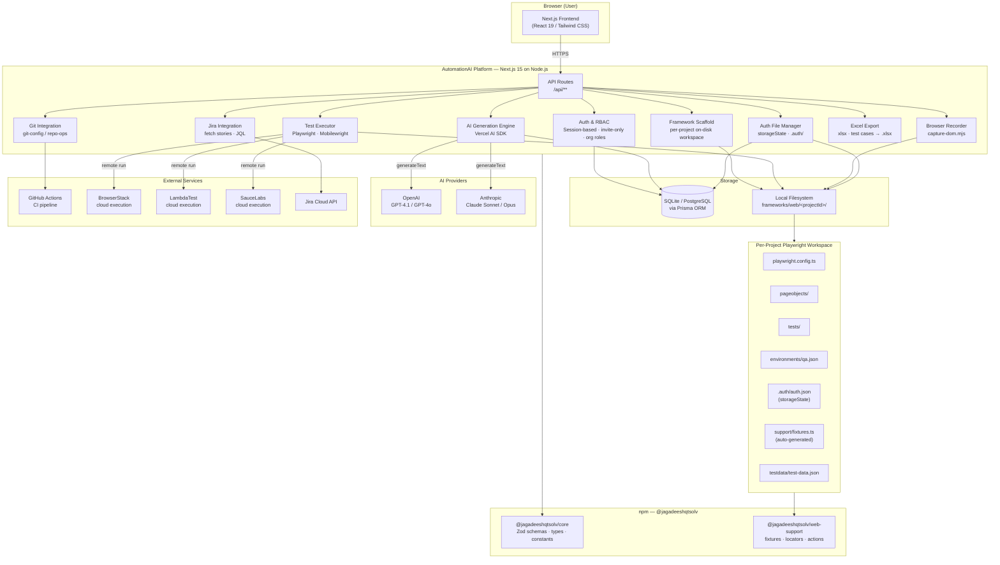
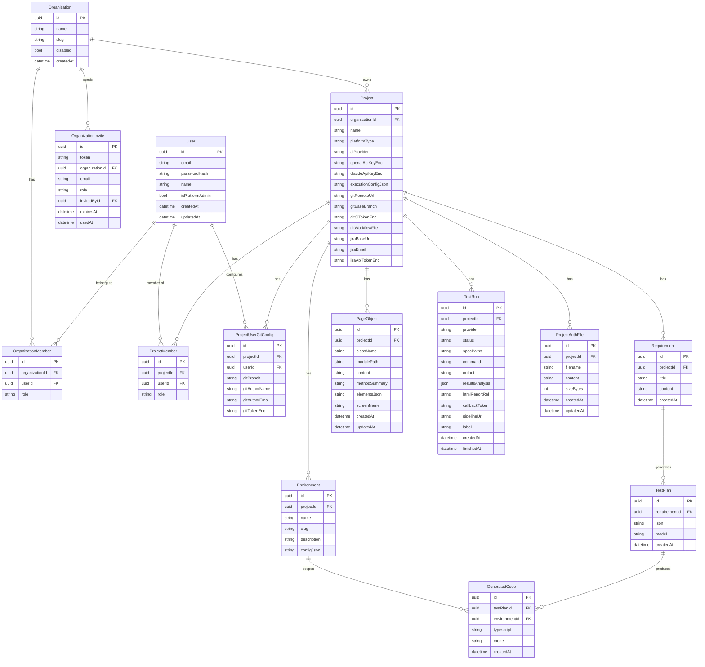
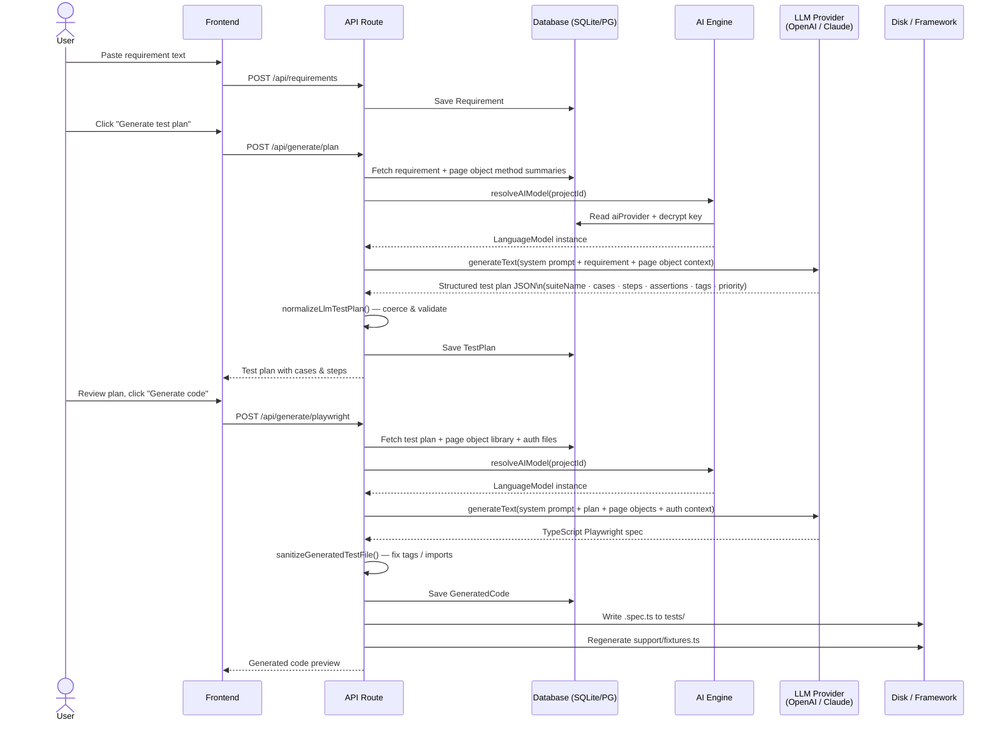
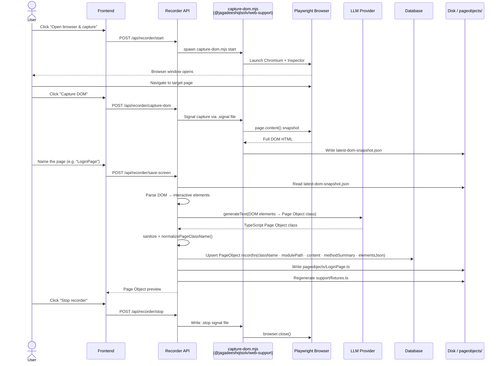
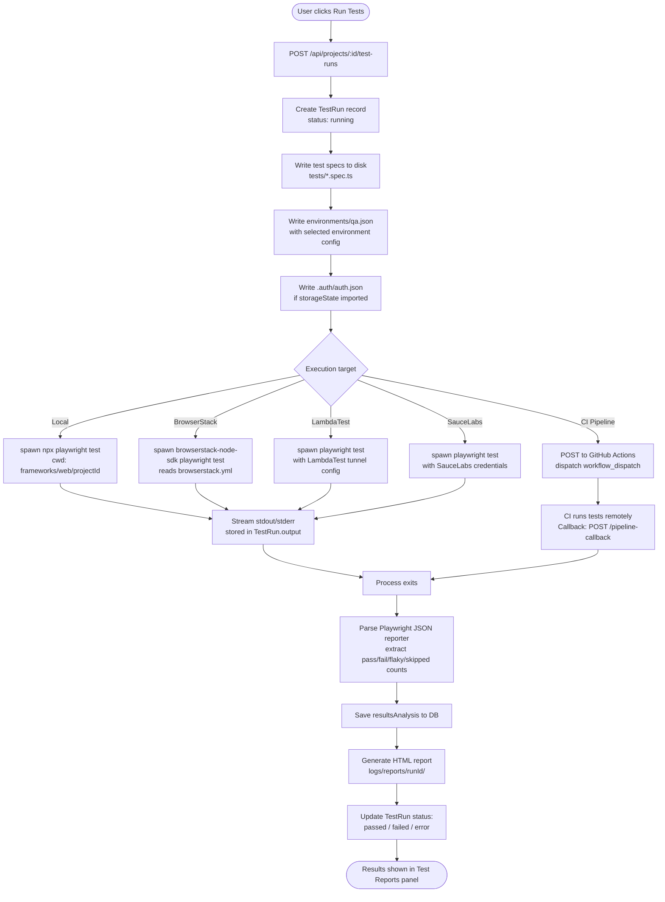
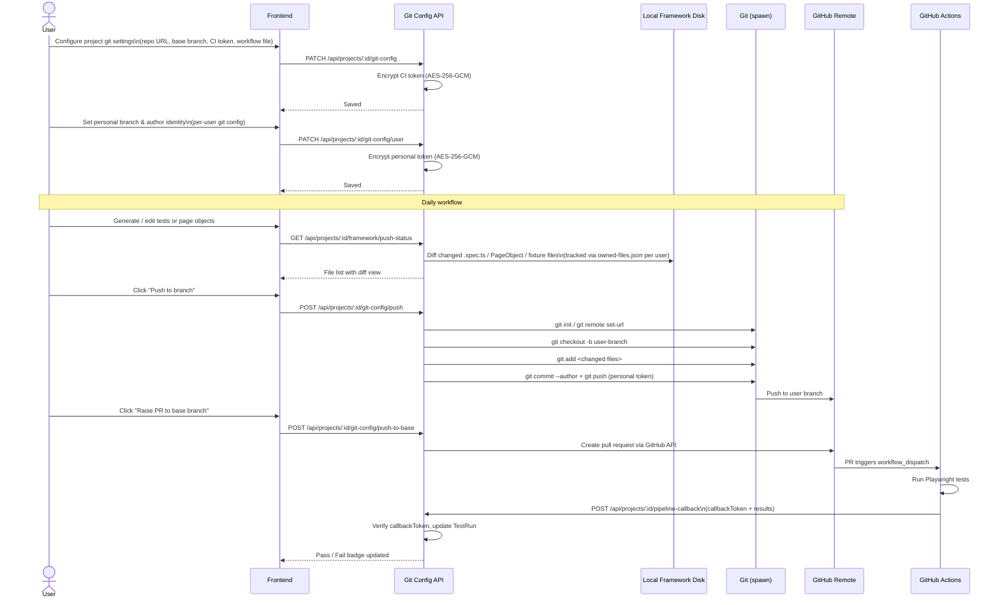
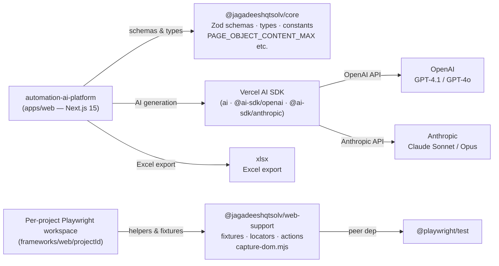

# AutomationAI — Architecture & Flow Diagrams

All diagrams use [Mermaid](https://mermaid.js.org/) and render natively on GitHub.

---

## Table of contents

1. [System Architecture](#1-system-architecture)
2. [Data Model](#2-data-model)
3. [User Journey](#3-user-journey)
4. [AI Test Generation Flow](#4-ai-test-generation-flow)
5. [Browser Recorder Flow](#5-browser-recorder-flow)
6. [Test Execution Flow](#6-test-execution-flow)
7. [Git & CI Integration Flow](#7-git--ci-integration-flow)
8. [Excel Export Flow](#8-excel-export-flow)
9. [Package Dependency Map](#9-package-dependency-map)

---

## 1. System Architecture

High-level view of every component and how they relate.



---

## 2. Data Model

Entity-relationship diagram derived from `apps/web/prisma/schema.prisma`.



---

## 3. User Journey

End-to-end flow from account creation to a passing test run.

```mermaid
flowchart TD
    A([Platform Admin]) -->|1 Create organisation| B[Organisation created]
    B -->|2 Send email invite| C[Invite token emailed]
    C -->|3 User registers with token| D[Account created & joined org]

    D -->|4 Create project\nweb or mobile| E[Project record saved]
    E -->|5 Auto scaffold| F["Playwright workspace created on disk\npageobjects/ tests/ environments/\nsupport/fixtures.ts  testdata/"]
    F -->|6 npm install + playwright install chromium| G[Framework ready]

    G -->|7 Configure AI provider\nOpenAI or Claude key| H[AI key stored encrypted]
    H -->|8 Import storageState JSON| HA["Auth file stored in DB + .auth/\nused automatically in all test specs"]

    HA --> I{Import requirements}
    I -->|Manual| J[Paste requirement text]
    I -->|Jira import| K[Fetch via JQL → Jira API]
    J & K --> L[Requirement saved to DB]

    L -->|9 Generate test plan| M["AI analyses requirement\n→ structured test plan JSON\ntest cases + steps + assertions + tags"]

    M -->|10 Review & edit test cases\nin built-in editor| ME[Test cases refined]
    ME -->|10a Export for manual testers| MX["Excel download\n.xlsx — Requirement · Suite · TC ID\nSteps · Expected Results · Preconditions"]

    ME -->|11 Generate test code| N["AI generates TypeScript\nPlaywright / Mobilewright spec\nsupport/fixtures.ts auto-wired"]

    N --> O{Page objects needed?}
    O -->|Yes — record browser| P[Browser Recorder\ncaptures live DOM snapshot]
    P -->|AI generates class| Q[PageObject saved to DB + disk]
    O -->|Already have POs| Q

    Q -->|12 Run tests| R[Test Executor spawns Playwright]
    R -->|13 Results| S[Pass / Fail / Flaky report\nHTML report generated]
    S -->|14 Optional: push to Git + trigger CI| T[GitHub Actions pipeline]
    T -->|CI callback| S
```



---

## 4. AI Test Generation Flow

Detail of how a requirement becomes executable test code.



---

## 5. Browser Recorder Flow

How a live page becomes a typed Page Object class.



---

## 6. Test Execution Flow

How a test run is started, executed, and reported.



---

## 7. Git & CI Integration Flow

How test code is versioned and pushed to a shared repository.



---

## 8. Excel Export Flow

How test plans are exported for manual testers.

```mermaid
sequenceDiagram
    actor User
    participant UI as Test Plans Section
    participant API as Export API Route
    participant DB as Database
    participant XLSX as xlsx package

    User->>UI: Click "Export Excel"
    UI->>API: GET /api/projects/:id/test-plans/export
    API->>DB: Fetch all Requirements + TestPlans (ordered by createdAt)
    DB-->>API: requirements[]\n  └ testPlans[]\n      └ json (test plan)

    API->>API: Parse each TestPlan JSON via testPlanSchema
    API->>API: For each test case:\n  • TC ID — RequirementName_001 (sequential)\n  • Tags — strip @ prefix for readability\n  • Preconditions — default if empty:\n    "Login required; User should have access"\n  • Steps → stepDescription() human-readable text\n  • Assertions → expectedResult() text

    API->>XLSX: Build worksheet (aoa_to_sheet)\nColumns: Requirement · Suite · TC ID · Title\nPriority · Tags · Platforms · Preconditions\nStep# · Step Description · Expected Result

    XLSX-->>API: Buffer
    API->>API: Build filename:\n  <RequirementTitle>_<epoch>.xlsx
    API-->>UI: application/vnd.openxmlformats-officedocument\nContent-Disposition: attachment
    UI-->>User: File download triggered
```

---

## 9. Package Dependency Map



---

## Technology Stack Summary

| Layer | Technology |
|---|---|
| **Web App** | Next.js 15 (App Router), React 19, Tailwind CSS |
| **Database** | SQLite (dev) / PostgreSQL (prod) via Prisma ORM |
| **AI Engine** | Vercel AI SDK — OpenAI GPT-4.1 / GPT-4o or Anthropic Claude |
| **Web Testing** | Playwright (TypeScript) |
| **Mobile Testing** | Mobilewright |
| **Cloud Execution** | BrowserStack · LambdaTest · SauceLabs |
| **Auth** | Session-based + Playwright storageState (`.auth/auth.json`) |
| **CI/CD** | GitHub Actions (workflow_dispatch + callback token) |
| **Excel Export** | xlsx npm package |
| **Encryption** | AES-256-GCM (API keys, git tokens) |
| **Containerisation** | Docker + Docker Compose |
