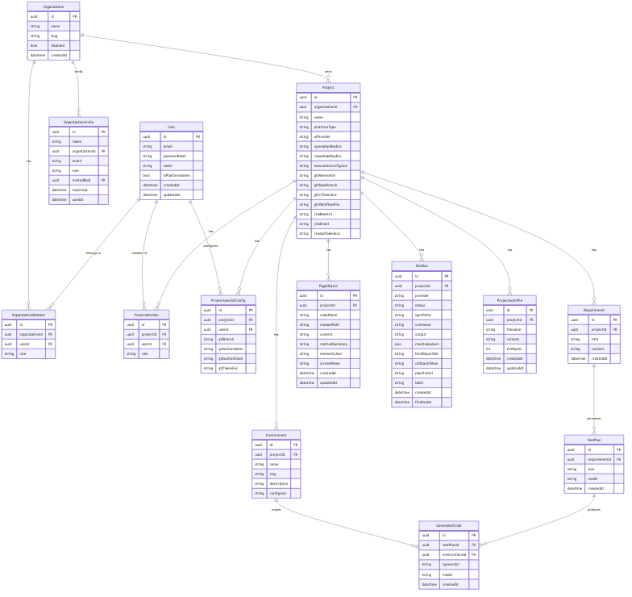
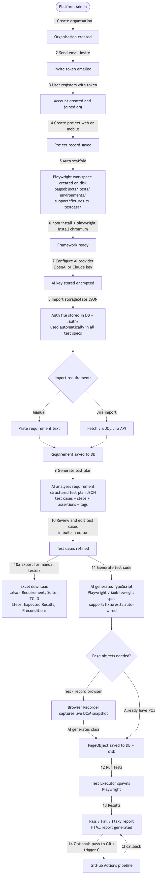
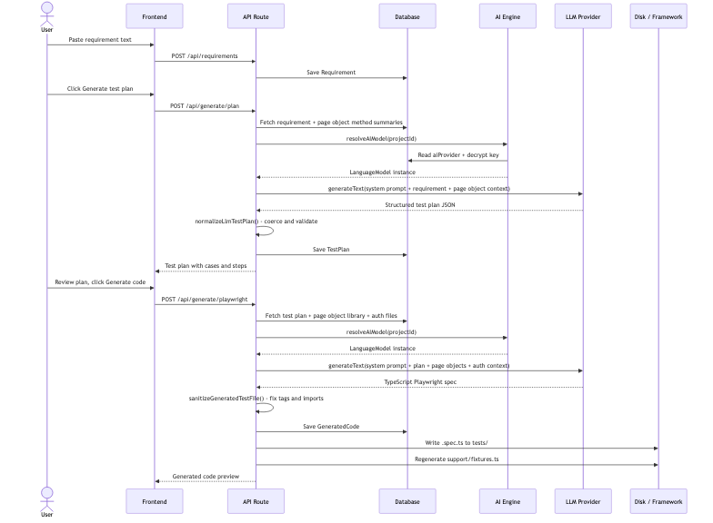
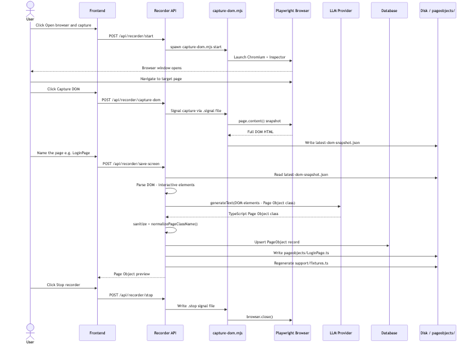
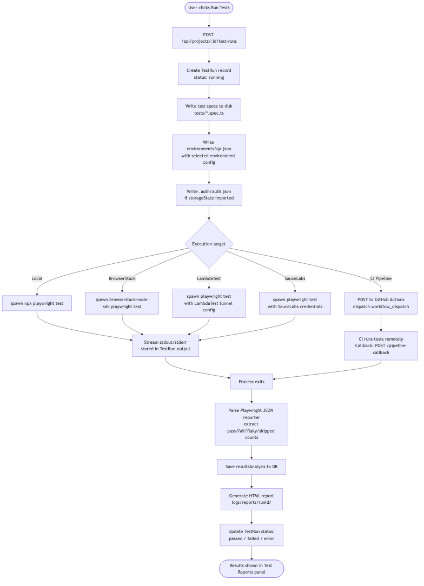
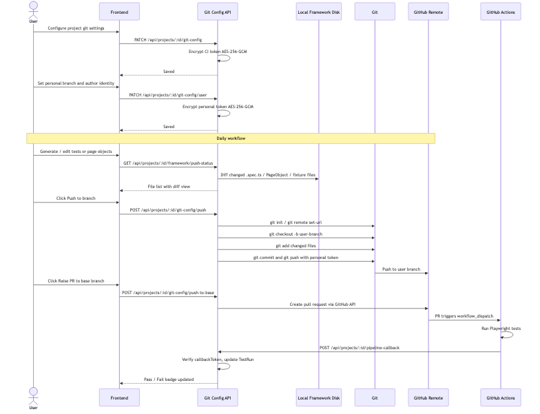
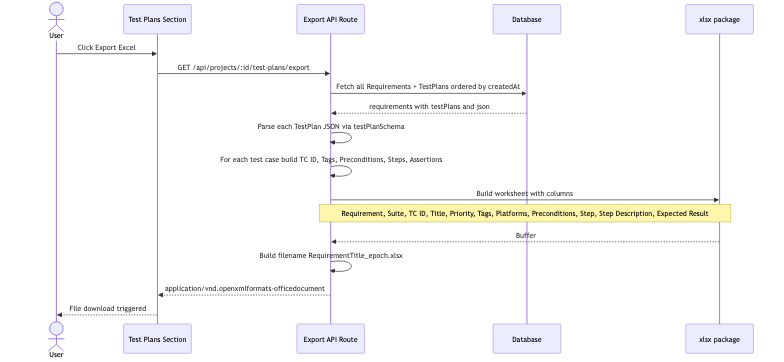
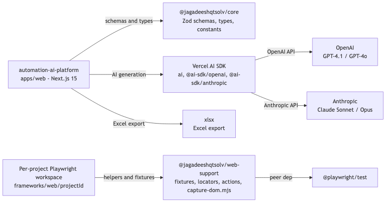

# AutomationAI — Architecture & Flow Diagrams

---

## Table of contents

1. [System Architecture](#1-system-architecture)
2. [Data Model](#2-data-model)
3. [User Journey](#3-user-journey)
4. [AI Test Generation Flow](#4-ai-test-generation-flow)
5. [Browser Recorder Flow](#5-browser-recorder-flow)
6. [Test Execution Flow](#6-test-execution-flow)
7. [Git & CI Integration Flow](#7-git--ci-integration-flow)
8. [Excel Export Flow](#8-excel-export-flow)
9. [Package Dependency Map](#9-package-dependency-map)

---

## 1. System Architecture

High-level view of every component and how they relate.

---

## 2. Data Model

Entity-relationship diagram derived from `apps/web/prisma/schema.prisma`.

---

## 3. User Journey

End-to-end flow from account creation to a passing test run.

---

## 4. AI Test Generation Flow

Detail of how a requirement becomes executable test code.

---

## 5. Browser Recorder Flow

How a live page becomes a typed Page Object class.

---

## 6. Test Execution Flow

How a test run is started, executed, and reported.

---

## 7. Git & CI Integration Flow

How test code is versioned and pushed to a shared repository.

---

## 8. Excel Export Flow

How test plans are exported for manual testers.

---

## 9. Package Dependency Map

---

## Technology Stack Summary

| Layer | Technology |
|---|---|
| **Web App** | Next.js 15 (App Router), React 19, Tailwind CSS |
| **Database** | SQLite (dev) / PostgreSQL (prod) via Prisma ORM |
| **AI Engine** | Vercel AI SDK — OpenAI GPT-4.1 / GPT-4o or Anthropic Claude |
| **Web Testing** | Playwright (TypeScript) |
| **Mobile Testing** | Mobilewright |
| **Cloud Execution** | BrowserStack · LambdaTest · SauceLabs |
| **Auth** | Session-based + Playwright storageState (`.auth/auth.json`) |
| **CI/CD** | GitHub Actions (workflow_dispatch + callback token) |
| **Excel Export** | xlsx npm package |
| **Encryption** | AES-256-GCM (API keys, git tokens) |
| **Containerisation** | Docker + Docker Compose |
